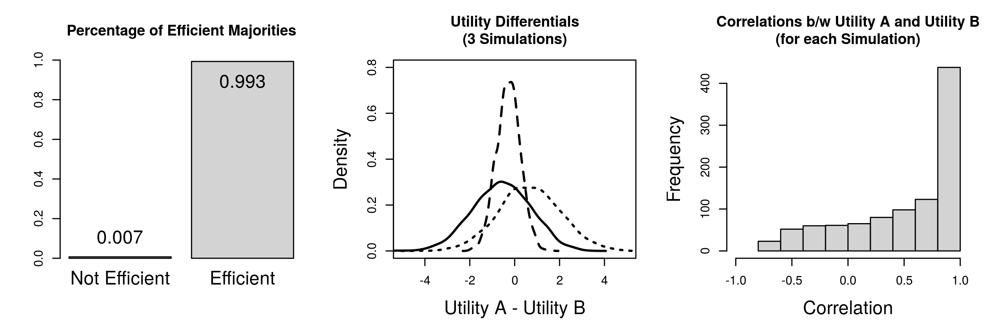
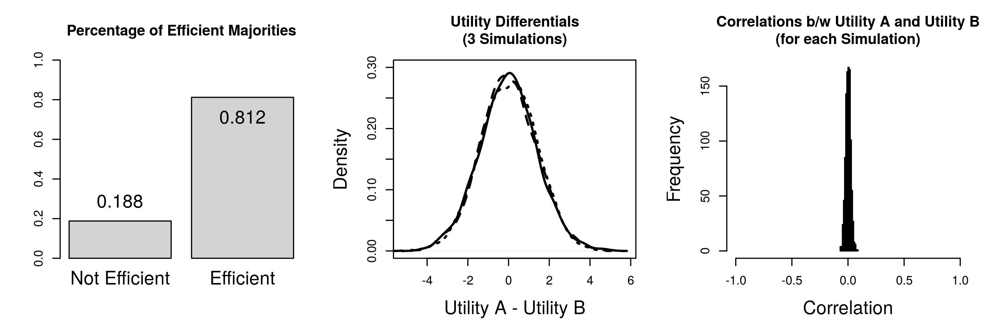
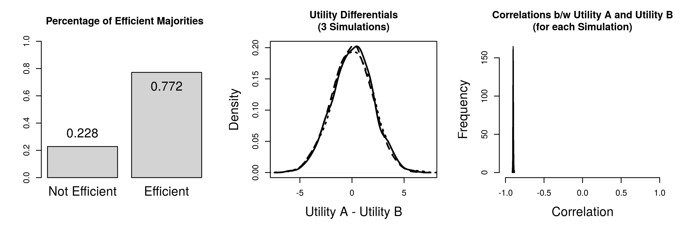
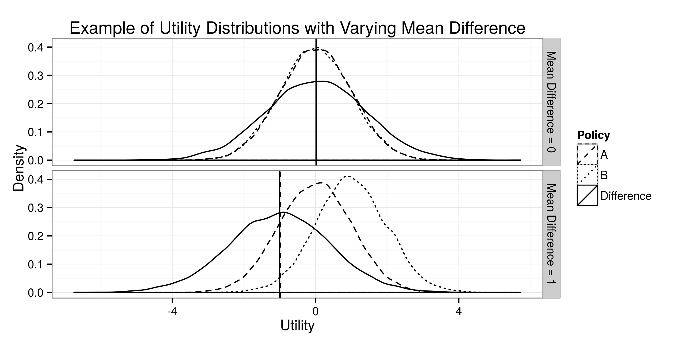
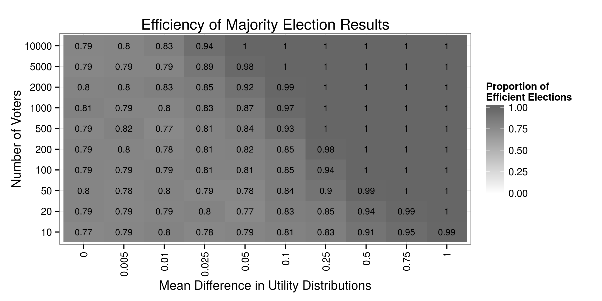
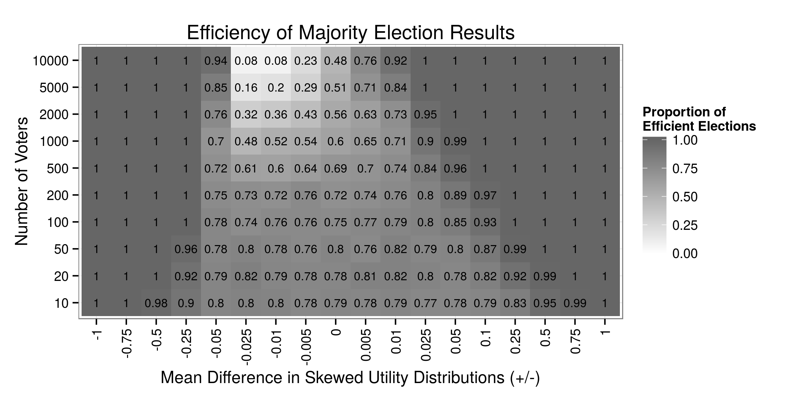
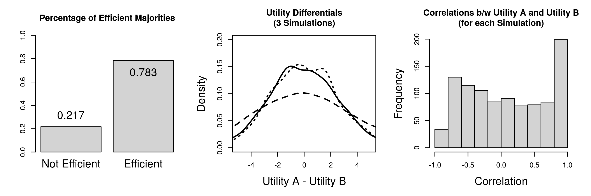
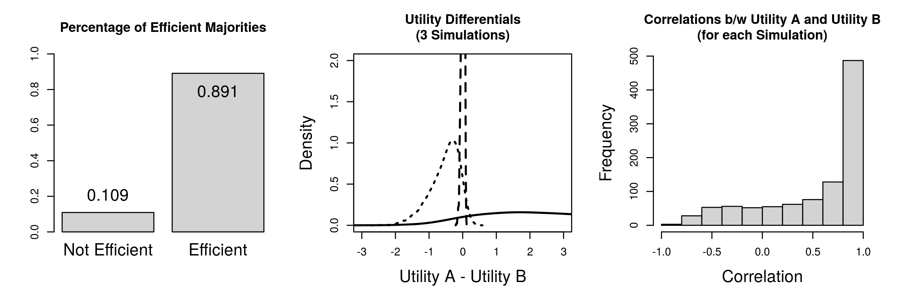

% \hspace{1.5cm}Relaxing Assumptions about Voter Utilities:\newline\large{How the Nature of Political Preferences Shapes the Efficiency of Majority Rule Voting}[^note]
% Peter DeScioli[^contact1]; Patrick Kraft[^contact2]
% this draft: \today

[^note]: Draft in preparation for the 2015 Annual Conference of the Midwest Political Science Association, comments welcome! The manuscript and simulation code are available on GitHub: <https://github.com/pwkraft/ideal-points>.
[^contact1]: Peter DeScioli is an Assistant Professor in political science at Stony Brook University (<pdescioli@gmail.com>).
[^contact2]: Patrick Kraft is a Ph.D. student in political science at Stony Brook University (<patrick.kraft@stonybrook.edu>).

\doublespacing

\begin{abstract}

Spatial voting models typically assume that voters and candidates can be placed on a common policy dimension and the voters' utilities can be determined by the relative proximity of their ideal points to the respective candidates (c.f. Downs 1957). In such a framework, simple majority elections between two candidates are generally expected to lead to desirable outcomes that maximize social welfare. The goal of this paper is to examine how the underlying assumption of voter utilities based on common policy dimensions affect the expected welfare outcomes of majority voting. More specifically, we present simulational studies in order to examine the efficiency of majority elections under different scenarios. We illustrate how the assumptions underlying the ideal-point framework influence the expected social welfare outcomes of majority voting rules.

\vspace{\baselineskip}
\textbf{Keywords:} Spatial Voting, Utility Assumptions, Majority Voting, Efficiency

\end{abstract}

\newpage

# Introduction

Spatial theories have a long tradition as a general framework for the the study of voting behavior as well as the analyses of candidate strategies in election campaigns. Pioneered in earlier work by @hotelling1929stability, @downs1957economic, and @black1958theory, many models of issue-based voting conceptualize political competition in a common multi- or unidimensional policy space in order to formalize voter preferences [for overviews, see @enelow1984spatial; @merrill1999unified]. Accordingly, spatial theories of voting assume that voter preferences can be described by (or approximated by) a common (multidimensional) policy space or a single ideological dimension. Individual utilities (for example in the context of elections) are thereby based on the voters' ideal points in the policy space in relation to the candidates' respective positions. While most applications of spatial voting models focus on the relative _proximity_ between voters and candidates in order to deduce individual utilities, other scholars proposed alternative ways of mapping candidate and voter positions on actual utilities [see for example @rabinowitz1989directional].

However, notwihstanding the debate between specific conceptualization of spatial voting models, a large body of research in political science and political psychology showed how a multitude of factors can affect voter preferences independent of pure issue positions and ideological dimensions. Classic studies such as _The American Voter_ [@campbell1960american] as well as subsequent work emphasizedthe importance of party identification as a general psychological attachement in voter decision making. Other factors that have been under consideration in more recent studies include, but are not limited to, the candidates’ traits and personalities, their perceived competence, and the nature of campaigns [see for example @hayes2005candidate]. For example, @todorov2005inferences showed that competence assessments solely based on candidate pictures successfully predicted the results in election results for the U.S. Congress [see also @mattes2010predicting]. Furthermore, the effect of candidate appearance on electoral success is not limited to the related inference about competence, but can be based on simple assessments of the beauty of candidates [@berggren2010looks]. These examples of non-issue based determinants of voter preferences indicate the underlying utilities for candidates or parties might not be reducible to a simple issue-based logic.

In the paper presented here, it will be argued, that focusing solely on policy-based utilities induces strong assumptions about the relationships between the utilities for competing candidates. Our goal is to show how relaxing such assumptions can alter our conclusions about the efficiency of voting rules. As an initial step, we will focus on a simple voting scenario of two competing candidates and varying sizes of the electorate. We present simulation studies in order to examine the efficiency of majority elections under different scenarios. Based on the simulation results, we propose an experimental design in order to provide further insights as to how the assumptions underlying the ideal-point framework influence the expected social welfare outcomes of voting rules.

# Political Preferences and the Ideal Point Framework

Spatial theories of voting provide a comprehensive framework to translate issue positions of candidates and members of the electorate into individual voter preferences as well as resulting candidate strategies. One of the fundamental assumptions underlying spatial models is, that individual positions regarding each policy issue or ideological dimensions can be described as an _ideal point_ on a continuous scale that encompasses all possible configurations. For example, looking at general health care policies, the end points of the policy space could be described as complete privatization of health care without government regulation on the one hand, and state-controlled complementary health insurance on the other end. Each point within this space represents a unique policy configuration between both extreme points [however, see @rabinowitz1989directional for an alternative interpretation focusing on the relative _emphasis_ on a specific issue position].

For example, Figure \ref{fig:ideal_plot} describes policy positions of five candidates ($A$ through $E$) as well as the ideal point of an individual voter ($X$). Using the health care example introduced above, the end points (-10 and 10) represent both extremes of complete privatization vs. government-run health care. Voter $X$ prefers some mixture between private and state controlled health care problems with a slight preference for private health care (-1). How can the utilities that voter $X$ could draw from each of the candidates be deduced in this framework?

Most spatial voting models assume that utilities are based on the relative _proximity_ between the voter's ideal point and the respective candidate position. This conceptualization has been introduced by @downs1957economic and further developed in subsequent work [e.g. @hinich1981new; @enelow1984spatial]. Most proximity voting models are conceptualized as the Euclidian distance between the voter's ideal point and each of the candidates under consideration.[^euclidian] Assuming a unidimensional framework, the utility of candidate $i$ for each party $j$ can be described as follows [c.f. @lewis1999no]:

\begin{equation}\label{eq:euclidian}
	U_{ij} = \alpha -\beta(X_i - X_j)^2
\end{equation}

[^euclidian]: A major alternative conceptualizations proposes the use of absolute distances instead of squared distances. However, we will focus on the squared distance in the remainder of the paper since it represents the most common approach in proximity models.

Where $U$ denotes the utility, $X_i$ denotes the voter's ideal point, and $X_j$ denotes candidate $j$'s position on the policy or ideological dimension. We include the unknown parameters $\alpha$ and $\beta>0$ to indicate the possibility of scaling of actual utilities. Without loss of generalizability, we will assume $\alpha = 0$ and $\beta=1$ in our subsequent simulations. According to this model, voter $X$ in Figure \ref{fig:ideal_plot} would maximize her utility if the policy proposed by candidate $C$ was implemented.

However, some scholars proposed alternative conceptualizations that map voter and candidate positions to individual utilities. The most prominent example is the _directional model_ proposed by @rabinowitz1989directional, which suggests that voter utilities increase the stronger a party emphasizes an issue on the same side of the neutral point (0 in Figure \ref{fig:ideal_plot}) as the voter. Accordingly, voter $X$ in Figure \ref{fig:ideal_plot} would be expected to prefer candidate $A$'s policy rather than candidate $C$'s policy (assuming that there is no `zone of acceptability' as sometimes proposed in the context of directional models). The ongoing debate whether the directional or proximity model is better suited to explain voter preferences and electoral behavior found proponents on both sides [@macdonald1991issues; @macdonald1995political; @westholm1997distance; @claassen2007ideology; @jessee2009spatial; @lacy2010testing]. Accordingly, some scholars proposed a unified framework combining both consideratione [e.g. @merrill1999unified, see also @kedar2005moderate; @claassen2009direction], while others argued that both theoretical approaches cannot be clearly distinguished and tested against each other due to the fact that they rely on fundamentally different assumptions [e.g. @lewis1999no]. Since it is out of the scope of this paper to discuss the theoretical or empirical merit of the proximity or the directional model, the following discussion as well as our simulational scenarios will focus solely on the proximity conceptualization of issue-based voter utilities.
 

# Alternative Factors Influencing Political Preferences

Traditional models of voting behavior initially focused on 

- Start with campbell/american voter, party identification
- discuss recent studies showing non-issue influences on voting behavior etc...

# Majority Voting and Social Welfare

- discuss @hastie2005robust
- discussion of majority voting as a voting rule that maximizes welfare in different experimental and simulational scenarios...
- Conceptualization of efficiency:
  - does the election result _maximize the aggregate utilities_ for all voters?

\begin{equation}
	\sum_i U_i^{W} \geq \sum_i U_i^{L}
\end{equation}

# Simulation Results

In order to investigate how different assumptions about voter utilities affect our evaluations of the efficiency of voting models, we propose the following simulational scenarios...

Description of simulational scenarios:

- number of _voters_ in each election: 2000
- number of candidates: 2
- number of simulations: 1000

\clearpage

## Comparing ideal points and independent normal utilities

Utilities based on normally distributed ideal points:

\begin{align}
	X_i,X_j &\sim \mathcal{N}(\mu=0,\sigma^2=1) \\
	U_{ij} &= -(X_i - X_j)^2
\end{align}

Utilities for both candidates based on independent normal distributions:

\begin{equation}
	U_{ij} \sim \mathcal{N}(\mu=0,\sigma^2=1)
\end{equation}

\clearpage

## Investigating the effect of correlated utilities

Positively correlated normal utilities:

\begin{equation}
	\mathbf{U}_{i} \sim \mathcal{N}\left(
    \mathbf{\mu} =\begin{pmatrix}0 \\ 0\end{pmatrix},
    \mathbf{\Sigma} =\begin{pmatrix}1 & 0.9 \\ 0.9 & 1\end{pmatrix}
    \right)
\end{equation}

Negatively correlated normal utilities:

\begin{equation}
	\mathbf{U}_{i} \sim \mathcal{N}\left(
    \mathbf{\mu} =\begin{pmatrix}0 \\ 0\end{pmatrix},
    \mathbf{\Sigma} =\begin{pmatrix}1 & -0.9 \\ -0.9 & 1\end{pmatrix}
    \right)
\end{equation}

\clearpage

## Inefficiencies for varying mean differences in utilities

\begin{equation}
	\mathbf{U}_{i} \sim \mathcal{N}\left(
    \mathbf{\mu} = \begin{pmatrix}0 \\ 0+\epsilon \end{pmatrix},
    \mathbf{\Sigma} =\begin{pmatrix}1 & 0 \\ 0 & 1\end{pmatrix}
    \right)
\end{equation}

\clearpage

## Investigating the effect of skewed utility distributions

\begin{align}
	U_{i,j=0} &\sim \mathcal{N}(\mu=0+\epsilon,\sigma^2=1) \\
	U_{i,j=1} &\sim \mathcal{N}^\text{skew}(\mu=0-\epsilon,\sigma^2=1)
\end{align}

\clearpage

## Inducing inefficiencies with ideal point utilities

Aggregate differences between ideal points:

\begin{align}
	X_i,X_{j=0} &\sim \mathcal{N}(\mu=0,\sigma^2=1) \\
	X_{j=1} &= -1*X_{j=0} \\
	U^{ij} &= -(X_i - X_j)^2
\end{align}

\clearpage

Skewed ideal points:

\begin{align}
	X_i &\sim \mathcal{N}^\text{skew}(\mu=0,\sigma^2=1) \\
	X_j &\sim \mathcal{N}(\mu=0,\sigma^2=1) \\
	U^{ij} &= -(X_i - X_j)^2
\end{align}

\clearpage

## Further simulational scenarios

# Possible Experimental Designs and Further Developments

- discuss @oprea2007compensation
- comparing auction mechanism to voting
- uncertainty about issue positions
- Performance of _compensation elections / bidding mechanisms_ in the context of binary choices @oprea2007compensation
- Effect of (endogenous) electoral _abstention_  on election efficiency
- Multi-candidate elections

# Conclusion

- _relaxing assumptions_ about ideal-point based preferences can reduce the likelihood that election results are efficient
  - _mean difference_ and _skewness_ of the distributions of individual utilities for each candidate affects the likelihood of inefficiencies
  - under some scenarios, increasing the _size of the electorate_ actually reduces the efficiency of majority voting!
- _Question_: conceptualization of utility reasonable? These results would not hold if preferences were purely ordinal (and utilities not comparable across individuals)

\clearpage

# References
