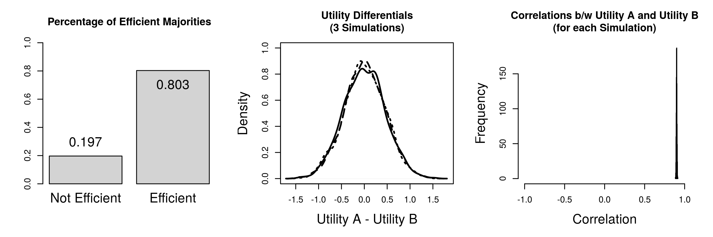

% \hspace{1cm}Relaxing Assumptions about Voter Utilities:\newline\large{How the Nature of Political Preferences Shapes the Efficiency of Majority Rule Voting}
% Peter DeScioli[^contact1]; Patrick Kraft[^contact2]
% this draft: \today

[^note]: Draft in preparation for the 2015 Annual Conference of the Midwest Political Science Association, comments welcome!
[^contact1]: Peter DeScioli is an Assistant Professor in political science at Stony Brook University (pdescioli@gmail.com).
[^contact2]: Patrick Kraft is a Ph.D. student in political science at Stony Brook University (patrick.kraft@stonybrook.edu).

\doublespacing

\begin{abstract}

Traditional models of issue voting assume that voters and candidates can be placed on a single policy dimension and the voters' utilities can be determined by the relative proximity of their ideal points to the respective candidates [c.f. @downs1957economic]. In such a framework, simple majority elections between two candidates are generally expected to lead to desirable outcomes that maximize social welfare. The goal of this paper is to examine how the underlying assumption of voter utilities based on common policy dimensions affect the expected welfare outcomes of majority voting. More specifically, we present simulational studies in order to examine the efficiency of majority elections under different scenarios. We illustrate how the assumptions underlying the ideal-point framework influence the expected social welfare outcomes of voting rules.

\vspace{\baselineskip}
\textbf{Keywords:} Utility Assumptions, Majority Voting, Efficiency

\end{abstract}

\newpage

# Introduction

A large body of research in political science and political sociology showed how a multitude of factors can affect voter preferences independent of pure issue positions and ideological dimensions. Such factors include, but are not limited to, the candidates’ traits and personalities, their perceived competence, and the nature of the campaign [see for example @hayes2005candidate]. For example, @todorov2005inferences showed that competence assessments solely based on candidate pictures successfully predicted the results in U.S. congressional elections [see also @mattes2010predicting]. Furthermore, the effect of candidate appearance on electoral success is not limited to the related inference about competence, but can be based on simple assessments of the beauty of candidates [@berggren2010looks]. These examples of non-issue based determinants of voter preferences indicate the underlying utilities for candidates or parties might not be reducible to a simple issue-based logic.

However, most formal models of social choice and assume that voter preferences can be described by (or approximated by) a single ideological dimension. Individual utilities (for example in the context of elections) are thereby formed based on the voters' ideal points in the policy space as well as the candidates' respective positions. More specifically, voter utilities are 

% more to add here...

In the paper presented here, it will be argued, that focusing solely on policy-based utilities induces strong assumptions about the relationships between the utilities for competing candidates. Our goal is to show how relaxing such assumptions can alter our conclusions about the efficiency of voting rules. As a first step, we will focus on a simple voting scenario of two competing candidates and varying sizes of the electorate. We present simulation studies in order to examine the efficiency of majority elections under different scenarios. Based on the simulation results, we propose an experimental design in order to provide further insights as to how the assumptions underlying the ideal-point framework influence the expected social welfare outcomes of voting rules.

# Political Preferences and the Ideal Point Framework

Spatial theories of elections and voter preferences have been very prominent in political science. The since they have been introduced by @downs1957economic

Formal models of voting behavior and political representation usually assume that the voters’ utilities are

Spatial theory of voting

- common policy / ideological dimension
- utilities determined by relative *proximity*
 $$U_i^\text{cand} = -(X_i - X^\text{cand})^2$$
 

# Majority Voting and Social Welfare

@hastie2005robust

# Simulation Results

Description of simulational scenarios:
- number of _voters_ in each election: 2000
- number of candidates: 2
- number of simulations: 1000

Conceptualization of efficiency:
does the election result _maximize the aggregate utilities_ for all voters?
$$ \sum_i U_i^{W} > \sum_i U_i^{L} $$

## Comparing ideal points and independent normal utilities

$$X_i,X_a,X_b \sim \mathcal{N}(\mu=0,\sigma^2=1)$$
$$U^a_i = -(X_i - X_a)^2 \hspace{1cm} U^b_i = -(X_i - X_b)^2$$

$$U^a_i,U^b_i \sim \mathcal{N}(\mu=0,\sigma^2=1)$$

## Investigating the effect of correlated utilities

$$U_a,U_b \sim \mathcal{N}\left(
    \mathbf{\mu}=\begin{pmatrix}0 \\ 0\end{pmatrix},
    \mathbf{\Sigma}=\begin{pmatrix}1 & 0.9 \\ 0.9 & 1\end{pmatrix}
    \right)$$

$$ U_a, U_b \sim \mathcal{N}\left(
    \mathbf{\mu}=\begin{pmatrix}0 \\ 0\end{pmatrix},
    \mathbf{\Sigma}=\begin{pmatrix}1 & -0.9 \\ -0.9 & 1\end{pmatrix}
    \right)$$

## Inefficiencies for varying mean differences in utilities

 $$U^a_i \sim \mathcal{N}(\mu=0,\sigma^2=1) \hspace{1cm}
  U^b_i \sim \mathcal{N}(\mu=0+\epsilon,\sigma^2=1)$$

 $$U^a_i \sim \mathcal{N}(\mu=0,\sigma^2=1) \hspace{1cm}
  U^b_i \sim \mathcal{N}(\mu=0+\epsilon,\sigma^2=1)$$

## Investigating the effect of skewed utility distributions

  $$U^a_i \sim \mathcal{N}(\mu=0+\epsilon,\sigma^2=1) \hspace{1cm}
  U^b_i \sim \mathcal{N}_\text{skew}(\mu=0-\epsilon,\sigma^2=1)$$

 $$U^a_i \sim \mathcal{N}(\mu=0+\epsilon,\sigma^2=1) \hspace{1cm}
  U^b_i \sim \mathcal{N}_\text{skew}(\mu=0-\epsilon,\sigma^2=1)$$

## Inducing inefficiencies with ideal point utilities

 $$X_i \sim \mathcal{N}_\text{skew}(\mu=0,\sigma^2=1) \hspace{1cm} X_a,X_b \sim \mathcal{N}(\mu=0,\sigma^2=1)$$
  $$U^a_i = -(X_i - X_a)^2 \hspace{1cm} U^b_i = -(X_i - X_b)^2$$

 $$X_i,X_a \sim \mathcal{N}(\mu=0,\sigma^2=1) \hspace{1.4cm} X_b = -1*X_a $$
  $$U^a_i = -(X_i - X_a)^2 \hspace{2cm} U^b_i = -(X_i - X_b)^2$$

## Further simulational scenarios

# Possible Experimental Designs and Further Developments

- Performance of _compensation elections / bidding mechanisms_ in the context of binary choices @oprea2007compensation
- Effect of (endogenous) electoral _abstention_  on election efficiency
- Multi-candidate elections

@oprea2007compensation

comparing auction mechanism to voting

uncertainty about issue positions

# Conclusion

- _relaxing assumptions_ about ideal-point based preferences can reduce the likelihood that election results are efficient
  - _mean difference_ and _skewness_ of the distributions of individual utilities for each candidate affects the likelihood of inefficiencies
  - under some scenarios, increasing the _size of the electorate_ actually reduces the efficiency of majority voting!
- _Question_: conceptualization of utility reasonable? These results would not hold if preferences were purely ordinal (and utilities not comparable across individuals)

\clearpage

# References
