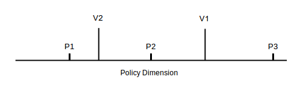
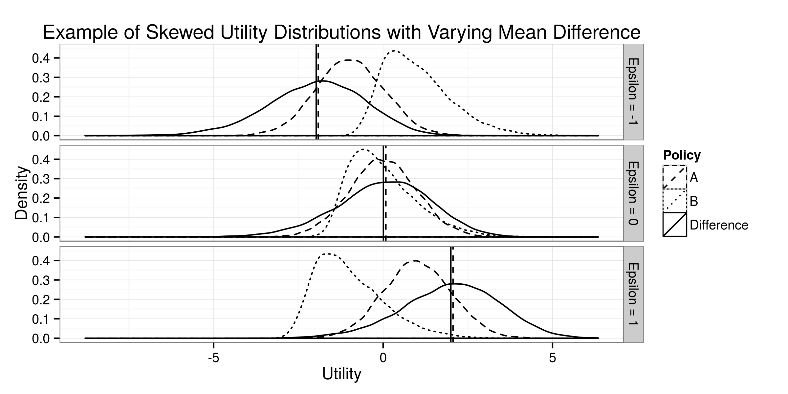

% \hspace{2.5cm}Should the majority rule?\newline When voting leads to suboptimal choices[^note]
% Peter DeScioli[^contact1]; Patrick Kraft[^contact2]
% \today

[^note]: Prepared for the 73rd Annual Conference of the Midwest Political Science Association, April 16-19, 2015. The manuscript and simulation code are available on GitHub: <https://github.com/pwkraft/ideal-points>.
[^contact1]: Peter DeScioli is an Assistant Professor in political science at Stony Brook University \newline (<pdescioli@gmail.com>).
[^contact2]: Patrick Kraft is a Ph.D. student in political science at Stony Brook University \newline (<patrick.kraft@stonybrook.edu>).

\doublespacing

\begin{abstract}\singlespace

Some political theorists have emphasized the benefits of majority rule for making group decisions whereas other theorists have warned about the potential harms to minorities. We use computer simulations to investigate how the distributions of voters’ preferences for two policies affect the economic efficiency of majority voting. We model voters’ preferences both with minimal assumptions and under the traditional assumption that they are derived from ideal points in a spatial policy dimension. We find that the efficiency of majority rule is highly contingent on the shapes of voters’ preferences. For several cases, majority rule picks the less efficient of two policies ~20\% of the time, in other cases its error rate approaches 0\% as the number of voters increases, and in the worst case it becomes more inefficient as the number of voters increases, making suboptimal choices as often as 90\% of time. We discuss the factors that affect the performance of majority rule and how traditional spatial theories of voting potentially exaggerate its efficiency.

\vspace{\baselineskip}
\textbf{Keywords:} Spatial Voting, Utility Assumptions, Majority Voting, Efficiency

\end{abstract}

\newpage

# Introduction

Majority rule is widely viewed as an exceptionally fair, equal, and effective method for making group decisions [for review, see @hastie2005robust]. At the same time, prominent political theorists such as John Adams, Alexis de Tocqueville, and John Stuart Mill have pointed to a deep flaw in majority decisions that can potentially cause great harm. The problem is that individuals in a majority might vote for an option that benefits themselves while imposing a much greater cost on individuals in a minority, yielding a net loss to the group as a whole. Here we use computer simulations to quantify the threats posed by majority rule. We vary the distribution of voters’ preferences including whether they are derived from proximity to ideal points [e.g., @enelow1984spatial], as traditionally assumed, or are directly drawn from independent, correlated, or skewed distributions. We test when majority rule is most beneficial and when it is most harmful. 

John Adams warned that majority rule allows a _tyranny of the majority_ in which a majority benefits itself at a greater expense to a minority. He argued that this problem is pervasive and severe: “And that the desires of the majority of the people are often for injustice and inhumanity against the minority, is demonstrated by every page of the history of the whole world” [@adams1851works, 48]. The threats posed by majorities motivated Adams and contemporaries to favor checks and balances in government such as judicial systems that protect individual rights against majorities. 

Other theorists have focused on the positive aspects of majority rule. Condorcet’s _jury theorem_ holds that majority rule yields more accurate decisions than any of the group’s members could have achieved alone, as long as individuals’ judgments are better than chance. However, in this classic model all voters have the same preferences, differing only in information. Hence, this model does not address conflicting preferences between majorities and minorities. 

Another theory holds that although tyranny of the majority is theoretically possible, it does not pose a critical problem for democracies [@olson1965logic]. Instead, Olson argued that the greater threat to society is powerful minorities exploiting weaker majorities rather than the reverse.

We address the debate about majority rule by quantifying how often it yields suboptimal group outcomes under different distributions of voter preferences. This approach describes the magnitude of the threat posed by majorities conditional on the shape of voters’ preferences. We model voters’ preferences both with minimal assumptions and under the traditional assumption that they are derived from ideal points in a spatial policy dimension [@black1958theory; @downs1957economic; @enelow1984spatial; @hotelling1929stability]. This allows us to test how the ideal-point framework affects conclusions about the welfare performance of majority voting. Ultimately, this work could guide empirical research to characterize voter preferences to identify political issues for which minorities are at greatest risk from majority rule. 

## Modeling voters’ conflicting preferences

A tyranny of the majority can occur when voters have conflicting preferences and their preferences have different magnitudes. If all voters’ preferences are the same size, then the majority choice necessarily maximizes total welfare. However, if some people’s preferences are stronger than others--such as a starving person’s preference for food versus someone else’s preference for luxury--then the majority’s choice does not necessarily maximize total welfare. For example, imagine a small group in which a well-nourished majority votes to confiscate a weaker person’s last remaining food. Despite being favored by the majority, the victim’s starvation outweighs the small benefits to members of the majority.

We follow convention by modeling voters’ preferences as _utilities_ [@stigler1950development]. We use utilities to represent the value that a voter derives from an outcome. This value comes in part from tangible rewards such as cash, goods, employment, or resources but it can also include diminishing returns, psychological effects, risk preferences, and social preferences [e.g., @charness2002understanding]. In short, whatever a voter values, whether tangible or intangible, selfish or altruistic, is summarized by their utility for that outcome. Further, we assume that utilities have magnitudes that can be compared and aggregated across individuals. Although these assumptions continue to be debated [e.g., @frank2000cost], they are necessary prerequisites for studying the benefits and harms of majority rule (or any institution). By aggregating utilities, we compare the _economic efficiency_ of the outcomes selected by majority rule voting. Economic efficiency refers to the aggregated satisfaction of preferences or total welfare gains associated with an outcome. 

In formal terms, the outcome of a vote is efficient under the condition: 

\vspace{-\baselineskip}

\begin{equation}\label{eq:eff}
	\sum_i U_i^{W} \geq \sum_i U_i^{L}
\end{equation}

where $U_i^W$ is the utility of voter i for the outcome favored by the majority, and $U_i^L$ is the utility of voter $i$ for the outcome opposed by the majority. Under this conception, it is quite straightforward to formulate a scenario in which the majority decision does not maximize aggregate social welfare. Table \ref{tab:majinef} shows an example with three voters’ preferences for two policies represented as utility payoffs.

\vspace{\baselineskip}
Table: Example for inefficient majorities \label{tab:majinef}

          Policy 1   Policy 2
-------  ---------- ----------
Voter 1   10         100
Voter 2   110        100
Voter 3   110        100

\vspace{-\baselineskip}

The majority of the electorate (voters 2 and 3) prefer policy 1, whereas policy 2 generates greater total payoffs for the entire electorate (300 versus 230).

Although the potential for inefficiency is easy to show, it is unclear how often groups might encounter this situation. In the present studies, we quantify the problem by making assumptions about voters’ preferences and simulating elections for each case. In study 1, we use minimal assumptions by drawing voters’ preferences from a normal distribution independently for each policy. In this model, a voter’s satisfaction from a policy is normally distributed just like many other individual traits. Moreover, their satisfaction from a second policy is also drawn from a normal distribution, independent of the first policy. This means that some voters’ will benefit from both policies, some will be harmed by both policies, and some will benefit from one and lose from the other policy. Independent policy utilities fit the complex realities of social groups which include a mixture of both shared and conflicting interests [e.g., @schelling1960strategy]. 

Voters’ independent utilities can lead to further complications when additional policies are added to the choice set. For example, _Condorcet’s paradox_ refers to situations in which no alternative is stable under majority rule voting. This occurs when there are at least three voters and three alternatives. Table \ref{tab:majcycle} shows how adding a third alternative with certain preferences creates cyclic winners.

\vspace{\baselineskip}
Table: Example for cyclic group preferences \label{tab:majcycle}

          Policy 1   Policy 2   Policy 3
-------  ---------- ---------- ----------
Voter 1   10         100        90
Voter 2   110        100        10
Voter 3   110        100        120

\vspace{-\baselineskip}

Specifically, Policy 1 defeats Policy 2, Policy 3 defeats Policy 1, and Policy 2 defeats Policy 3, such that none of the alternatives can win a majority over both of the remaining alternatives. Hence, even though all voters have transitive preferences, their aggregate preferences are not necessarily transitive. However, this problem of cyclic group preferences is resolved by spatial models of voter preferences, which we turn to next.

## Spatial models of political preferences

Many formal models of political preferences and competition use additional assumptions to constrain voters’ preferences. In spatial theories of voting, the electorate’s options are positioned on a continuous dimension from one extreme to another [@black1958theory; @downs1957economic; @enelow1984spatial; @hotelling1929stability]. Each voter has an _ideal point_ that also occurs on the same dimension. A voter’s utility for a policy is a function of the distance between their own ideal point and the position of the policy. Voters are expected to choose the policy that is closest to them in the policy space.

Assuming a uni-dimensional framework, each voter’s utility for a policy is as follows [c.f. @lewis1999no]:

\vspace{-\baselineskip}

\begin{equation}\label{eq:euclidian}
	U_{ij} = -(V_i - P_j)^2
\end{equation}

Where $U_{ij}$ denotes the utility of voter $i$ for policy $j$, $V_i$ is the voter's ideal point, and $P_j$ is the position of policy $j$ on the respective dimension. Alternatively, some models use absolute distances instead of squared distances. However, we will focus on the squared distance in the remainder of the paper since it represents the most common approach in proximity models [c.f. @merrill1999unified; @lewis1999no]. Furthermore, conceptualizing utilities as a squared distance invokes the reasonable assumption that individuals value deviations from their own position as less severe when they are still closer to their ideal point.

To illustrate a spatial approach, consider a group of voters deciding whether the government should provide health care. The extreme end points of the policy space are completely public health care or completely private health care whereas intermediate positions in the space correspond to intermediate government provisions of health care. Each voter is assumed to have an ideal point on this dimension that describes their own most preferred level of government sponsorship, and they favor policies that are closer to their most preferred option.

Theories of spatial preferences eliminate the possibility of cyclic voting [c.f. @black1948rationale]. To see how this works, we can map voters’ preferences in Table \ref{tab:majcycle} onto a unidimensional policy space shown in Figure \ref{fig:ideal_plot}.

According to voter 1’s preferences, they should be closest to policy 2, next closest to policy 3, and furthest from policy 1; these preferences are shown by voter 1’s ideal point in Figure \ref{fig:ideal_plot}. Voter 2, on the other hand, should be very close to policy 1 (in fact, closer than V1 is to P2), followed by policy 2 and policy 3. So far, the ideal point configuration is consistent with the payoffs in Table \ref{tab:majcycle}.

However, it becomes obvious that within this spatial framework and the utility constraints outlined thus far, it is impossible to depict an ideal point for voter 3 that is consistent with their preference order P3 > P1 > P2. As such, characterizing individual utilities based on a unidimensional policy space essentially rules out the possibility of cyclic preferences on the aggregate. Imposing such constraints can be useful in some applications for understanding political competition and electoral behavior [e.g., @gehrlein2002condorcet]. Nonetheless, researchers should be aware that these assumptions might not hold for some political preferences and they should be mindful of the implications when they do not hold. 

## The present studies

In the present studies, we examine the economic efficiency of majority rule beginning with minimal assumptions and then adding incremental complexity. We look at the simplest case of an electorate choosing between two policies A and B. Voters’ utilities for each policy are randomly drawn from a normal distribution for each policy independently. We then compare such scenarios to configurations where utilities are derived from (unidimensional) spatial policy positions (see below). We measure how often majority rule picks the option that yields greater aggregate utility for the group as a whole. Subsequent studies add correlated preferences and skewed preferences to describe the performance of majority rule in these circumstances. 

# Study 1: Direct versus spatial utilities

Study 1 examines the efficiency of majority rule in two conditions. In the first condition, voters’ preferences for each option are independently drawn from a normal distribution. In the second condition, voters’ preferences are derived by first randomly drawing the position of two policies on a common policy dimension which applies to the whole electorate, and then randomly drawing each voter’s ideal point on the same dimension. 

## Methods

We generate 1000 electorates of 2000 voters facing a simple choice between two policies. Individuals vote for the policy that gives them the greatest utility. Simulations were run in the program \texttt{R}. In two treatments, we vary how voters’ preferences are generated. In the direct treatment, voters’ utilities for each policy are drawn randomly and independently from a normal distribution. 

\vspace{-\baselineskip}

\begin{equation}
	U_{ij} \sim \mathcal{N}(\mu=0,\sigma^2=1)
\end{equation}

Where $U_{ij}$ denotes the utility of voter $i$ for policy $j$. In the spatial treatment, we generate utilities based on normally distributed ideal points for each voter.

\vspace{-\baselineskip}

\begin{align}
	V_i,P_j &\sim \mathcal{N}(\mu=0,\sigma^2=1) \\
	U_{ij} &= -(V_i - P_j)^2
\end{align}

Where $V_i$ denotes the ideal point of voter $i$, $P_j$ is the position of policy $j$, and the remaining variable meanings are equivalent to the previous equation.

We measure economic efficiency by summing voters’ utilities for each policy in each election and calculate the percentage of elections in which majority rule selects the alternative associated with greater aggregate utility (see equation \ref{eq:eff}). 

We examine two additional measures to understand the different implications of direct and spatial preferences. First, we compute utility differentials between the two policies by subtracting voters’ utilities for policy B from their utilities for policy A, giving their relative preferences for each policy. A voter with a positive differential favors policy A and a voter with a negative differential favors policy B (0 indicates indifference between policies). 

Plotting the distribution of utility differentials allows us to directly investigate the median as well as the mean aggregate preferences of the electorate, which tracks likelihood of efficient election outcomes. More specifically, if the mean and median of the utility differentials indicates preferences for opposite candidates, the requirement for efficient elections is not met (since such a pattern is equivalent to $\sum_i U_i^W < \sum_i U_i^L$). 

We also measure correlations between individual utilities from each policy alternative. If direct and spatial conditions differ in efficiency, one possible source of the difference is in the underlying correlations between voters’ preferences. 

## Results

The results are shown in Figures \ref{fig:s1b} and \ref{fig:s1a} (left). For direct preferences, majority rule selected the efficient outcome in 81.2% of elections. For spatial preferences, on the other hand, majority rule maximized social welfare in almost all of the elections (99.3%).

Next, we look at utility differentials. Figures \ref{fig:s1b} and \ref{fig:s1a} (center) show the utility differentials for the electorate in 3 simulations to illustrate the pattern. In the direct treatment, the utility differentials follow a normal distribution centered at zero. The electorate is, in aggregate, indifferent between policies. Accordingly, the means and medians of the utility differentials only deviate slightly from election to election ($SD_{\mu} = 0.032$, $SD_{\sigma}=0.039$). In the spatial treatment, we observe more variation in the utility differentials. As before, neither policy is systematically preferred by the electorate across elections. However, the electorates have stronger, more one-sided preferences for one of the policy options ($SD_{\mu}=2.019$, $SD_{\sigma}=2.02$). 

Last, we look at correlations between voters’ preferences for policy A and policy B. Figures \ref{fig:s1b} and \ref{fig:s1a} (right) display the histogram of correlations between individual utilities for all elections. In the direct condition, since utilities for both alternatives are drawn independently, they show minimal correlations across elections. 

In the spatial condition, in contrast, the utilities are highly correlated in most elections. This pattern can be explained by the fact that the ideal points of a large part of the electorate were randomly placed _outside_ of both policy positions. More generally, if both policies were placed at each end-point of the ideological scale, such that all voters would be placed on a point between both policies, then the utilities for both policies generated in this scenario would be perfectly negatively correlated: the higher the utility for one policy, the lower the utility for the other policy. If, however, members of the electorate have ideal points that are more extreme than either of the policy positions, then the utilities for this part of the electorate are necessarily positively correlated: As these outside voters move further from policy A, they also move further from policy B.

## Discussion

In sum, when we make minimal assumptions about voters’ preferences, we find that majority rule chooses the less efficient of two options 18.8% of the time. This is a substantial error rate that supports John Adams and other theorists’ concerns about tyranny of the majority. This result occurred in the direct condition in which voters’ utilities for each policy were drawn independently from a normal distribution. 

In contrast, if we assume that a voter’s preferences are derived from their ideal point in a policy space, then majority rule chooses the better option 99.3% of the time—it is almost never wrong. Under this conception, there is little reason to fear tyranny of the majority because it would occur in only the rarest circumstances. 

There are several possible sources of the differences between direct versus spatial models. The utility differentials and correlations between utilities show marked divergence. In the direct condition utilities show correlations very near zero and utility differentials are centered very close to 0, whereas in the spatial condition there is more variation in the utility differentials as well as the correlational patterns, with a modal correlation close to positive 1. 

Another potential difference is that for the spatial preferences, we located each policy by drawing from a normal distribution on the policy space. Because voters’ ideal points were also normally distributed on the space, one of the policies was likely to have a sizeable advantage in aggregate utility. In contrast, the direct utilities were drawn from the same normal distribution and so were statistically likely to have very small differences. 

We evaluate these sources of differences in subsequent studies.

# Study 2: Correlated policy utilities

Voters’ utilities for two policies might be uncorrelated when some voters benefit from both policies, some voters are harmed by both policies, and some voters benefit from one policy while being harmed by the other policy. However, for some issues, voters’ preferences can instead be positively or negatively correlated. Positive correlations mean that many voters benefit from both policies or are harmed by both policies. Negative correlations mean that those voters who benefit from one policy are harmed by the alternative policy. 

Perhaps the most common public perception of politics is that it involves negative correlations in citizens’ preferences. Groups of citizens are viewed as struggling for power in a zerosum game, which implies negatively correlated preferences. Despite this common perception, most social interactions involve a mixture of both shared and conflicting interests. Even competitive and hostile interactions such as fist-fights, hockey games, bargaining, and warfare simultaneously involve shared interests and cooperative aspects [@schelling1960strategy]. Thus, political theorists should expect voters’ preferences to vary across different issues, likely encompassing the full range from negative to zero to positive correlations.

Counter to common views of politics, we found in study 1 that the spatial model often implies positive correlations in political preferences. This occurs because voters on the outside of the two policies incur greater harm from both policies as they get further away (and greater benefit from both policies as they move closer while remaining outside). This positive correlation would be even more pronounced if political competition leads to convergence of policies to the median voter’s ideal point, as spatial models predict [@black1948rationale; @downs1957economic; @hotelling1929stability], because most or all voters will be on the outside of the convergent policies.

In study 2, we examine the efficiency of majority rule for positively and negatively correlated utilities. We consider only direct utilities. We repeat the same method used for the direct treatment in study 1, except that we induce positive or negative correlations in voters’ preferences. This allows us to test how the efficiency of majority rule depends on correlations of preferences. It also allows us to test whether the findings of study 1 for direct utilities were derived from the zero correlation of preferences.

## Methods

The simulations were identical to study 1, direct condition, except for how voters’ preferences were generated. In the positive-correlation condition, policy utilities are drawn from a multivariate normal distribution in which both utilities are strongly positively correlated. More specifically, utilities were generated as follows:

\begin{equation}
	\mathbf{U}_{i} \sim \mathcal{N}\left(
    \mathbf{\mu} =\begin{pmatrix}0 \\ 0\end{pmatrix},
    \mathbf{\Sigma} =\begin{pmatrix}1 & 0.9 \\ 0.9 & 1\end{pmatrix}
    \right)
\end{equation}

Where $\mathbf{U}_{i}$ is a vector of utilities of voter $i$ for each policy $j$, $\mu$ is a vector of distribution means, and $\Sigma$ is the variance-covariance matrix. In the negative-correlation condition, utilities are drawn from a multivariate normal distribution where utilities are negatively correlated:

\begin{equation}
	\mathbf{U}_{i} \sim \mathcal{N}\left(
    \mathbf{\mu} =\begin{pmatrix}0 \\ 0\end{pmatrix},
    \mathbf{\Sigma} =\begin{pmatrix}1 & -0.9 \\ -0.9 & 1\end{pmatrix}
    \right)
\end{equation}

Where the variable and parameter meanings are equivalent to the previous equation.

## Results

In the positive-correlation condition, majority rule selected the efficient outcome 80.3% of the time (Figure \ref{fig:s2a}, left). In the negative-correlation condition, majority rule selected the efficient outcome 77.2% of the time (Figure \ref{fig:s2b}, left).

Next, we look at utility differentials. Figures \ref{fig:s2a} and \ref{fig:s2b} show three illustrative elections for each condition. In the positive-correlation condition, we observe a narrow spread for the utility differentials, as shown on the x-axis. In contrast, negative-correlations led to a greater spread as shown on the x-axis of Figure \ref{fig:s2b}, center. Across all elections, the deviations in means and medians are slightly lower in the condition of negatively correlated utilities ($SD_{\mu}=0.01$, $SD_{\sigma}=0.013$) as compared to the positive condition ($SD_{\mu}=0.044$, $SD_{\sigma}=0.056$), which can be explained by the larger variance in the utility differentials for each simulation.

The correlational patterns displayed in Figure \ref{fig:s2a} and \ref{fig:s2b} (right) confirm that the preference-generating procedure created positive and negatively correlated preferences, respectively.

## Discussion

The results show that the correlations between utilities did not substantially affect the efficiency of the election results. For positive, negative, and zero (study 1) correlations, majority rule selected the efficient policy ~80% of the time and the suboptimal choice ~20% of the time. This finding shows that tyranny of the majority occurs across a range of political preferences, whether they exhibit positive, zero, or negative correlations. 

This observation also implies that the difference in correlations between direct and spatial utilities in study 1 was not driven only by their different correlational structure. 

# Study 3: Mean differences in policy utilities

Studies 1 and 2 found a high error rate of ~20% for majority rule for direct utilities. However, citizens’ preferences or each policy were drawn from the same distribution. This assumes that citizens’ aggregate preferences are close to indifferent between the two policies. 

In the present study, we induce mean differences is utilities for policy A versus policy B. We examine for a given size difference how good is majority rule at selecting the option from the greater distribution. Given that this is a signal detection problem, the size of the electorate is likely to be important for the accuracy of majority rule. Hence, we also manipulate the number of voters. 

## Methods

The simulations were identical to study 1, direct condition, except that utilities for each policy were drawn from different distributions, varying the size of the mean difference between 0 and 1 standard deviation. We also varied the number of voters from 10 to 10,000. 

More specifically, voters’ preferences were generated as follows:

\vspace{-\baselineskip}

\begin{align}
	U_{i,j=0} &\sim \mathcal{N}(\mu=0,\sigma^2=1) \\
	U_{i,j=1} &\sim \mathcal{N}(\mu=0+\epsilon,\sigma^2=1)
\end{align}

Where $\epsilon$ denotes the mean difference in utility distributions and the remaining variable and parameter meanings are equivalent to the previous scenarios. Figure \ref{fig:s3a} presents two examples of the elections under consideration here. The dashed lines represent the utility distributions for the two policies, whereas the solid line represents the utility differential, i.e. the distribution of the difference between both utilities. The solid and dashed vertical bars denote the mean as well as the median of the utility differential. The upper graph displays the case in which the aggregate difference between utility distributions is set at zero (equivalent to the simulations presented in Figure \ref{fig:s1b}). The lower graph presents an election in which policy B utilities were drawn from a distribution that was one standard deviation greater than policy A. Accordingly, the utility differential (A - B) is centered below zero. In aggregate, this electorate prefers policy B over policy A.

## Results and Discussion

Figure \ref{fig:s3b} shows the efficiency results by the mean difference in underlying policy utilities and the number of voters. The results show that majority rule becomes more efficient as the mean difference between policy utilities increases, approaching 100% efficiency as the difference reaches 1 standard deviation. 

For intermediate differences, such as 0.10 and 0.25 standard deviations, the efficiency depends on the number of voters, with more voters leading to greater efficiency. For instance, when there are only 10-20 voters, majority rule has a substantial error rate of ~15-20% even with a difference of 0.25 standard deviations between underlying policy utilities. 

These findings to some extent allay fears about tyranny of the majority. As long as the electorate is large enough and there is a substantial difference in underlying policy utilities, majority voting is expected to be efficient. However, suboptimal majority choices do occur for smaller numbers of voters as found for example on many committees, juries, boards, and other small groups of decision-makers. 

# Study 4: Skewed policy utilities

We next examine the question of how the shape of the utility distribution relates to the observed efficiency of election results. As mentioned in the beginning of this paper, we expect inefficiencies to emerge if preferences in the electorate differ systematically in magnitude. Accordingly, we will now investigate scenarios where utilities for one of the policies is skewed. Substantially, such a skewed distribution can be interpreted as a case where strong supporters of a policy receive substantially larger benefits than the benefit lost by opponents.

## Methods

The simulations were identical to study 3 except that policy A utilities were drawn from a normal distribution and policy B utilities were drawn from a skewed distribution. Voters’ preferences were generated as follows:

\vspace{-\baselineskip}

\begin{align}
	U_{i,j=0} &\sim \mathcal{N}(\mu=0+\epsilon,\sigma^2=1) \\
	U_{i,j=1} &\sim \mathcal{N}_\text{skew}(\mu=0-\epsilon,\sigma^2=1,\gamma=.85)
\end{align}

Where $\gamma$ denotes the skewness of the distribution and the remaining variable and parameter meanings are equivalent to the previous scenarios. Figure \ref{fig:s4a} shows examples of 3 elections with skewed preferences. Dashed lines represent the utility distribution for both policies and the solid line represents the utility differential. Given that one of the utility distributions is skewed (policy B, skewness parameter is $\gamma = .85$), the utility distribution is also slightly skewed. Accordingly, the mean and median of the utility differential deviate from each other.

## Results and Discussion

Figure \ref{fig:s4b} displays the results. As in study 3, efficiency approaches 100% as the mean difference in policy utilities reaches 1 or -1 standard deviations. However, in contrast to the previous results, the effect of the number of voters is less straightforward. Quite strikingly, for certain mean differences between both utility distributions, increasing the number of voters decreases efficiency to less than 10% accuracy at selecting the more efficient outcome.

This pattern can be explained by the fact that inefficiency occurs if the mean and median of the utility differential fall on opposite sides of the neutral zero point. More specifically, if the median of utility differential is positive, then the majority of the electorate prefers policy A; if, however, the mean of the utility differential is negative at the same time, then the aggregate utility is maximized for policy B. If the mean difference in the (skewed) utility distributions is such that mean and median of the differential are likely to fall on opposite sides of the neutral point, then increases in the size of the electorate diminish the probabilities of efficient majorities.

These results show that the skewness of preferences for one of two policies can in some cases lead to quite severe cases of tyranny of the majority, which can be more pronounced if the electorate is sufficiently large. 

# Study 5: Inefficiencies with spatial utilities

In study 5, we reexamine the spatial utilities from study 1 to test whether symmetric policy locations and skewed utilities can lead to inefficient majorities in a spatial framework.

In the spatial condition of study 1, we first randomly draw two policy positions before proceeding to draw voters’ ideal points. This procedure is likely to yield asymmetric policy positions which necessarily gives one policy an advantage, given that voters’ ideal points are drawn from a normal distribution on the space. In study 5, we draw the first policy position randomly but then assign the second policy position to be its mirror image. Hence, neither policy has an initial advantage prior to drawing voters’ ideal points. We hypothesize that this procedure will generate inefficiencies more comparable to those found for direct utilities (~20%). 

We also introduce skew into a spatial preference framework. Since skewed preferences for policy B caused greater inefficiency in study 4 for direct utilities, we hypothesize that skew will also increase inefficiency with spatial utilities.

## Methods

The simulations were identical to study 1, spatial condition, except for how we generate preferences. In the symmetric-policy condition, we generate utilities as follows:

\vspace{-\baselineskip}

\begin{align}
	V_i,P_{j=0} &\sim \mathcal{N}(\mu=0,\sigma^2=1) \\
	P_{j=1} &= -1*P_{j=0} \\
	U_{ij} &= -(V_i - P_j)^2
\end{align}

Accordingly, the position of policy B (i.e. $j=1$) is constrained to mirror the position of policy A ($j=0$) on the respective dimentsion. In the skew condition, we generate utilities as follows:

\vspace{-\baselineskip}

\begin{align}
	V_i &\sim \mathcal{N}_\text{skew}(\mu=0,\sigma^2=1,\gamma=.85) \\
	P_j &\sim \mathcal{N}(\mu=0,\sigma^2=1) \\
	U_{ij} &= -(V_i - P_j)^2
\end{align}

Here, we introduced a skewed distribution of ideal points ($V_i$) in the electorate, while the candidate positions ($P_j$) are again drawn from a standard normal distribution.

## Results and Discussion

In the symmetric-policy condition (Figure \ref{fig:sX2}), majority rule selected the efficient outcome 78.3% of the time. This result is basically equivalent to the results for direct utilities in studies 1 and 2. This might suggest that the original difference between direct and spatial conditions in study 1 was driven by the greater initial advantage of one policy over another in the spatial framework. 

In the skew condition (Figure \ref{fig:sX1}), majority rule selected the efficient outcome 89.1% of the time. This finding shows that within the spatial framework, even without assuming symmetric policies, inefficiency can result from skewed preference distributions.

# General Discussion

The simulations presented here demonstrate that the efficiency of majority rule is highly contingent on the shapes of voters’ utilities for each policy. Even in a very simple election with only two policies, majority rule selects the suboptimal policy ~20% of the time. This error rate decreases to zero as the mean difference increases between underlying policies. Nonetheless, there is a substantial risk of inefficiency for smaller groups and moderate differences around 0.25 standard deviations.

Skewed preferences can lead to even lower inefficiency in some cases, as low as below 10% in the simulations reported here. Moreover, it is worth emphasizing again that there are configurations for which increasing the number of voters in the electorate (or equivalently the participation rate), might actually be harmful for the performance of majority-based decision-making.

Furthermore, spatial theories might overstate the efficiency of majority decisions, particularly if policy positions are unconstrained and hence frequently asymmetric (Study 1, spatial condition). They also imply positive correlations among voters’ preferences for different policies, particularly if political competition leads to convergence since all voters’ ideal points will then be located outside of the competing policies. Positively correlated preferences contradict public perceptions of politics and seem unlikely to characterize all types of political preferences.

The present studies point to several directions for future research. First, we can vary more parameters in the model to examine the effects on efficiency. Potentially important variables include the amount of skewness, the number of policies, and uncertainty about a policy’s payoffs. Second, we can model political competition in the direct utilities framework to see which policies and bundles of policies could be stable under majority voting. Third, we can investigate political participation and how electoral abstention affects efficiency including when voting is costly.

Fourth, we can examine alternative collective decision processes besides majority rule. Alternative institutions include other voting rules such as approval, preferential, or cumulative voting as well as auction mechanisms in which citizens bid for their preferred outcome [@oprea2007compensation]. Fifth, we can examine efficiency in laboratory experiments with human participants to compare to simulation results. 

Last, researchers can measure citizens’ political preferences for different issues to estimate the risk of tyranny of the majority. To accurately measure the magnitudes of preferences, researchers will probably need to make expressing those preferences costly because otherwise many participants are likely to exaggerate them. The shapes of citizens’ preferences can then be compared to analogous simulations and experiments to determine the likelihood that the majority will favor suboptimal choices.

\clearpage

# References
